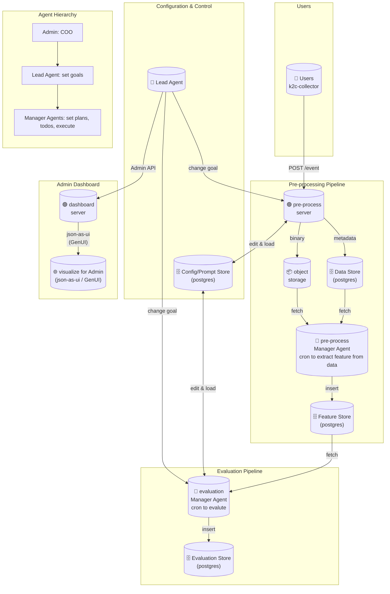

# k2c-hackathon

This is a service that user sends its screenshot in interval and can see the analysis result in the admin dashboard.

## Architecture



## File Structure

```
.
├── AGENTS.md # instructions
├── fnox.toml # env and secrets
├── k2c-agents 
│   └── docker-compose.yaml # minio and postgres setup
├── k2c-collector # collector project
├── k2c-dashboard # UI dashboard project
├── mise.toml # `mise task` definitions and tools to install
└── README.md
```

## Tech stack

### k2c-agents

- Python project
- Use `uv` and `pyproject.toml`
- MUST use openai-agents-sdk in `k2c-agents/`
- use postgres as store at its connection string is set as env in `fnox.toml`
- use minio as object storage at its credentials is set as env in `fnox.toml`
- use db migrate  using `golang-migrate` its command is at `mise.toml` and  migrations are set in `k2c-agents/migrations/000001_create_tables.up.sql` and `k2c-agents/migrations/000001_create_tables.down.sql`
