# k2c-hackathon

This is a service that user sends its screenshot in interval and can see the analysis result in the admin dashboard.

## Architecture

```mermaid
flowchart TB
    subgraph Users
        U[("👥 Users<br/>k2c-collector")]
    end

    subgraph PreProcess["Pre-processing Pipeline"]
        PPS[("🟢 pre-process<br/>server")]
        OBJ[("📦 object<br/>storage")]
        DS[("🗄️ Data Store<br/>(postgres)")]
        PPMA[("🔴 pre-process<br/>Manager Agent<br/>cron to extract feature from data")]
        FS[("🗄️ Feature Store<br/>(postgres)")]
    end

    subgraph Config["Configuration & Control"]
        CPS[("🗄️ Config/Prompt Store<br/>(postgres)")]
        LA[("🔴 Lead Agent")]
    end

    subgraph Evaluation["Evaluation Pipeline"]
        EMA[("🔴 evaluation<br/>Manager Agent<br/>cron to evalute")]
        ES[("🗄️ Evaluation Store<br/>(postgres)")]
    end

    subgraph Dashboard["Admin Dashboard"]
        DBS[("🟢 dashboard<br/>server")]
        UI[("🌐 visualize for Admin<br/>(json-as-ui / GenUI)")]
    end

    %% User flow
    U -->|"POST /event"| PPS
    
    %% Pre-process flow
    PPS -->|"binary"| OBJ
    PPS -->|"metadata"| DS
    OBJ -->|"fetch"| PPMA
    DS -->|"fetch"| PPMA
    PPMA -->|"insert"| FS

    %% Config flow
    PPS <-->|"edit & load"| CPS
    %% Evaluation flow
    LA -->|"change goal"| EMA
    LA -->|"change goal"| PPS
    CPS <-->|"edit & load"| EMA
    FS -->|"fetch"| EMA
    EMA -->|"insert"| ES

    %% Dashboard flow
    LA -->|"Admin API"| DBS
    DBS -->|"json-as-ui<br/>(GenUI)"| UI

    %% Hierarchy note
    subgraph Hierarchy["Agent Hierarchy"]
        direction TB
        H1["Admin: COO"]
        H2["Lead Agent: set goals"]
        H3["Manager Agents: set plans, todos, execute"]
        H1 --> H2 --> H3
    end
```



## File Structure

```
.
├── AGENTS.md # instructions
├── fnox.toml # env and secrets
├── k2c-agents 
│   └── docker-compose.yaml # minio and postgres setup
├── k2c-collector # collector project
├── k2c-dashboard # UI dashboard project
├── mise.toml # `mise task` definitions and tools to install
└── README.md
```

## Tech stack

### k2c-agents

- Python project
- Use `uv` and `pyproject.toml`
- MUST use openai-agents-sdk in `k2c-agents/`
- use postgres as store at its connection string is set as env in `fnox.toml`
- use minio as object storage at its credentials is set as env in `fnox.toml`
- use db migrate  using `golang-migrate` its command is at `mise.toml` and  migrations are set in `k2c-agents/migrations/000001_create_tables.up.sql` and `k2c-agents/migrations/000001_create_tables.down.sql`
