# k2c-hackathon

This service builds a knowledge graph from user screenshots to infer a company's logical context.

## Architecture

```mermaid
flowchart TB
    subgraph Users
        U[("👥 Users<br/>k2c-collector")]
    end

    subgraph PreProcess["Pre-processing Pipeline"]
        PPS[("🟢 pre-process<br/>server")]
        OBJ[("📦 object<br/>storage")]
        DS[("🗄️ Data Store<br/>(postgres)")]
    end

    subgraph Indexing["Indexing Pipeline"]
        IDX[("🟢 indexer<br/>server")]
    end

    subgraph KG["Knowledge Graph"]
        KGDB[("🗄️ KG Graph<br/>(neo4j)")]
    end

    subgraph Dashboard["Admin Dashboard"]
        DBS[("🟢 dashboard<br/>server")]
        UI[("🌐 visualize for Admin<br/>(json-as-ui / GenUI)")]
    end

    %% User flow
    U -->|"POST /event"| PPS

    %% Pre-process flow
    PPS -->|"binary"| OBJ
    PPS -->|"metadata"| DS
    PPS -->|"processed metadata"| IDX

    %% Indexing flow
    IDX -->|"upsert graph"| KGDB

    %% Dashboard flow
    DBS -->|"query graph"| KGDB
    DBS -->|"json-as-ui<br/>(GenUI)"| UI
```



The pipeline is now focused on building a knowledge graph from screenshots.
Preprocessor and Indexer are separate services, and Evaluator/Lead agents are removed.

## File Structure

```
.
├── AGENTS.md # instructions
├── docker-compose.yaml # postgres, minio, neo4j
├── fnox.toml # env and secrets
├── k2c-agents 
├── k2c-indexer # indexer server + agent (neo4j)
├── k2c-collector # collector project
├── k2c-dashboard # UI dashboard project
├── mise.toml # `mise task` definitions and tools to install
└── README.md
```

## Tech stack

### k2c-agents

- Python project
- Use `uv` and `pyproject.toml`
- MUST use openai-agents-sdk in `k2c-agents/`
- use postgres as store at its connection string is set as env in `fnox.toml`
- use minio as object storage at its credentials is set as env in `fnox.toml`
- use db migrate  using `golang-migrate` its command is at `mise.toml` and  migrations are set in `k2c-agents/migrations/000001_create_tables.up.sql` and `k2c-agents/migrations/000001_create_tables.down.sql`

### k2c-indexer

- Python project
- Use `uv` and `pyproject.toml`
- use postgres as store at its connection string is set as env in `fnox.toml`
- use neo4j as the primary knowledge graph database
- use db migrate using `golang-migrate` its command is at `mise.toml` and migrations are set in `k2c-indexer/migrations/000001_create_index_jobs.up.sql` and `k2c-indexer/migrations/000001_create_index_jobs.down.sql`
