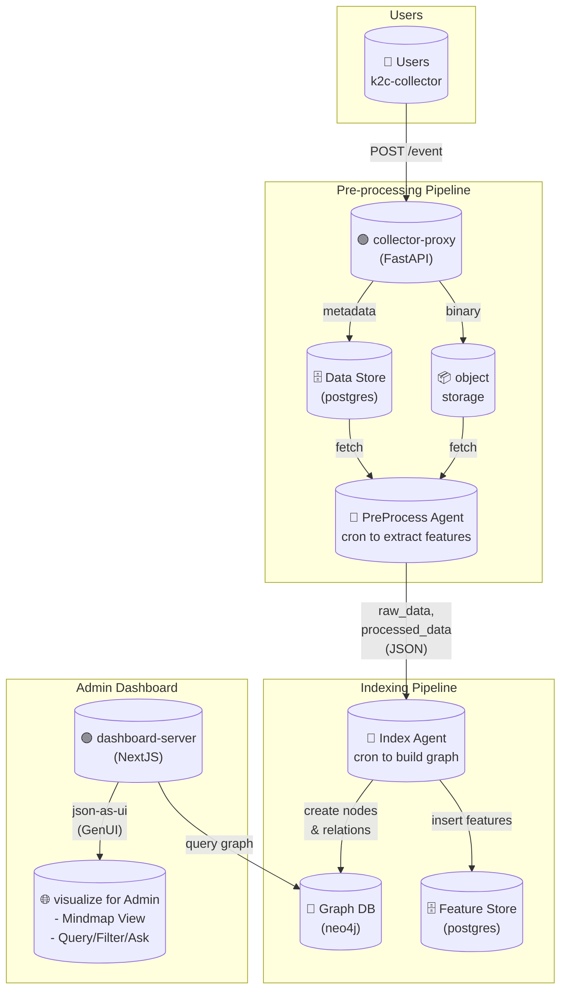

# 팀명

K2C

> *Knowledge to Connect:* 추가적인 integration 없이 유저의 스크린샷만으로 조직 전체의 업무 컨텍스트를 저장·연결·추적하는 지식 그래프 플랫폼입니다.

## 데모

- https://k2c.jaehong21.com

## 문제 정의

조직의 실제 업무 맥락은 툴이 아니라 사람의 화면(screen) 위에 존재
- 여러 SaaS에 흩어진 정보
- 설정·권한·연동 비용이 큰 integration
- 로그와 문서만으로는 파악되지 않는 실제 작업 흐름

결과적으로, 회사에서 ‘지금 무슨 일이 일어나고 있는지’를 전체적으로 추적할 수 없는 문제

## 솔루션

K2C는 유저 스크린샷 하나만으로 조직의 컨텍스트를 자동으로 축적하고 연결
- 스크린샷 업로드만으로 데이터 수집 (No Integration)
- 멀티 에이전트가 화면에서 개체·행동·의미를 추출
- 시간에 따라 누적된 컨텍스트를 지식 그래프로 연결
- 이용자는 대시보드에서 흐름·관계·변화를 한눈에 탐색

> **툴을 연결하지 않고, 화면을 연결해 회사의 지식을 만듭니다**
> **Create company knowledge by connecting screens, not tools**

## 조건 충족 여부

- [x] OpenAI API 사용
- [x] 멀티에이전트 구현
- [x] 실행 가능한 데모

## 아키텍처



## 기술 스택

- OpenAI Agents SDK for agents
- FastAPI for collector-proxy
- NextJS for dashboard-server
- PostgreSQL for data store & feature store
- Neo4j for graph database
- Minio for object storage

## 설치 및 실행

```bash
# Install mise
# https://mise.jdx.dev/installing-mise.html
curl https://mise.run/zsh | sh
mise install

# Set OpenAI API Key
export OPENAI_API_KEY="xxx"
echo $OPENAI_API_KEY

# check if docker and docker-compose is installed & running
docker ps
docker compose ls
docker compose up -d postgres

mise run "db.migrate"
docker compose up -d
```

## 향후 계획 (Optional)

- 팀/조직 단위 그룹화 및 권한 관리
- 개인정보 마스킹 및 보안 관련 고민

## 팀원

| 이름 | 역할 |
| ---- | ---- |
|김단은|      |
|정재홍|      |
|이중곤|      |
