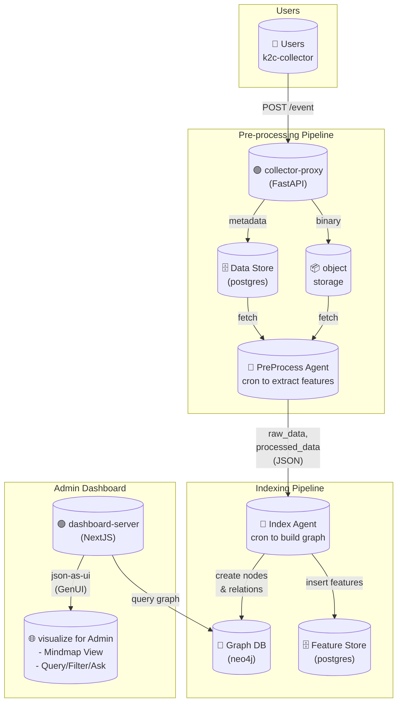

# 팀명

## 데모

- https://k2c.jaehong21.com

## 문제 정의


## 솔루션


## 조건 충족 여부

- [x] OpenAI API 사용
- [x] 멀티에이전트 구현
- [x] 실행 가능한 데모

## 아키텍처



## 기술 스택

- OpenAI Agents SDK for agents
- FastAPI for collector-proxy
- NextJS for dashboard-server
- PostgreSQL for data store & feature store
- Neo4j for graph database
- Minio for object storage

## 설치 및 실행

```bash
# Install mise
# https://mise.jdx.dev/installing-mise.html
curl https://mise.run/zsh | sh
mise install

# Set OpenAI API Key
export OPENAI_API_KEY="xxx"
echo $OPENAI_API_KEY

# check if docker is installed & running
docker ps

mise run "docker-compose.up"
```

## 향후 계획 (Optional)

-
-

## 팀원

| 이름 | 역할 |
| ---- | ---- |
|김단은|      |
|정재홍|      |
|이중곤|      |
